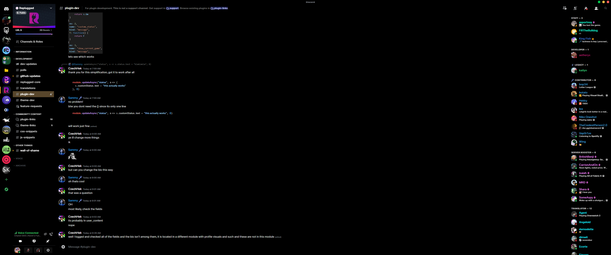
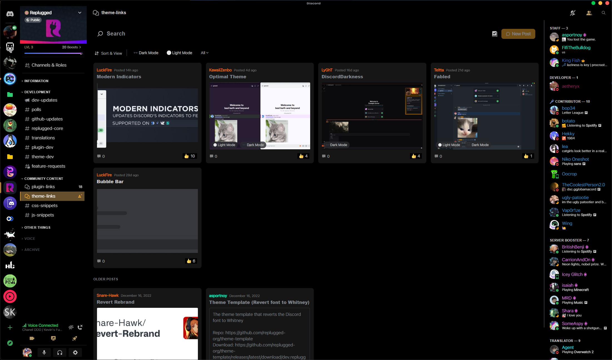

## Zex OLED

Discord Theme designed with OLED Displays in mind.

## Recommended Add-ons

[Modern Indicators](https://github.com/discord-extensions/modern-indicators) really pretties up the
Indicators in a way I could never figure out.

## Installation

Download
[this file](https://github.com/Zexyen/Umbran/releases/latest/download/dev.Zexyen.Umbran.asar) and
put it into your replugged themes folder.

- **Windows** `%appdata%/replugged/themes`
- **macOS** `~/Library/Application Support/replugged/themes`
- **Linux** `~/.config/replugged/themes`

## Screenshots

